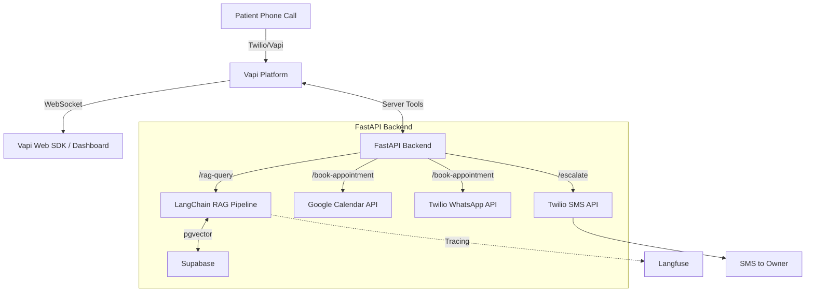

# AI Voice Receptionist

An automated voice receptionist for dental clinics that uses natural conversational AI to handle patient FAQs, intelligently book appointments, and gracefully escalate complex queries to human managers. 

## Architecture



## Tech Stack
- **Frontend**: Next.js 14, TailwindCSS, Supabase Auth, Vapi Web SDK
- **Backend**: FastAPI, Python 3.10
- **AI/RAG**: LangChain, ChatGroq (Llama-3), HuggingFace BGE Embeddings
- **Database**: Supabase (Postgres + pgvector)
- **Integrations**: Vapi (Voice), Google Calendar, Twilio (WhatsApp Sandbox + SMS), Langfuse (LLM Tracing)

## Setup Instructions

### 1. Supabase Setup
Create a Supabase project and enable `pgvector`.
Run the provided SQL schemas in your SQL editor to create the `businesses`, `faqs`, `appointment_slots`, and `knowledge_chunks` tables.

### 2. Environment Variables
Copy `.env.example` to `.env` in both the `frontend` and `backend` directories and fill in the required keys:

**Backend (`backend/.env`)**
```env
# Supabase
SUPABASE_URL=your_supabase_url
SUPABASE_KEY=your_supabase_service_role_key

# Vapi
VAPI_API_KEY=your_vapi_private_key
BACKEND_URL=your_ngrok_or_render_url

# AI / Tracing
GROQ_API_KEY=your_groq_key
LANGFUSE_PUBLIC_KEY=your_langfuse_pk
LANGFUSE_SECRET_KEY=your_langfuse_sk
LANGFUSE_HOST=https://cloud.langfuse.com

# Integrations
TWILIO_ACCOUNT_SID=your_twilio_sid
TWILIO_AUTH_TOKEN=your_twilio_auth
TWILIO_WHATSAPP_NUMBER=+14155238886
GOOGLE_SERVICE_ACCOUNT_JSON={"type":"service_account",...}
CLINIC_CALENDAR_ID=your_calendar_id@group.calendar.google.com
TWILIO_SMS_NUMBER=+1234567890
OWNER_PHONE=+19876543210
```

**Frontend (`frontend/.env.local`)**
```env
NEXT_PUBLIC_SUPABASE_URL=your_supabase_url
NEXT_PUBLIC_SUPABASE_ANON_KEY=your_supabase_anon_key
NEXT_PUBLIC_VAPI_PUBLIC_KEY=your_vapi_public_key
NEXT_PUBLIC_BACKEND_URL=http://localhost:8000
```

### 3. Local Development

**Backend:**
```bash
cd backend
python -m venv venv
source venv/bin/activate
pip install -r requirements.txt
uvicorn main:app --reload --port 8000
```

**Frontend:**
```bash
cd frontend
npm install
npm run dev
```

### 4. Deployment
- **Backend**: Deploy to Render as a Web Service using the `uvicorn main:app --host 0.0.0.0 --port 10000` start command. Set all environment variables.
- **Frontend**: Deploy to Vercel. Ensure `NEXT_PUBLIC_BACKEND_URL` points to your live Render backend url.
